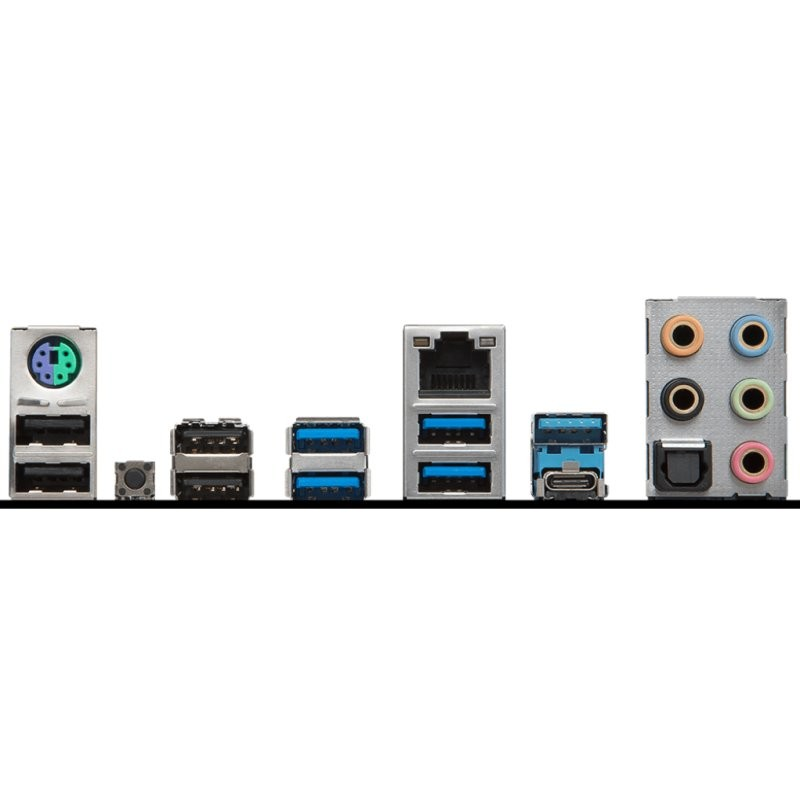
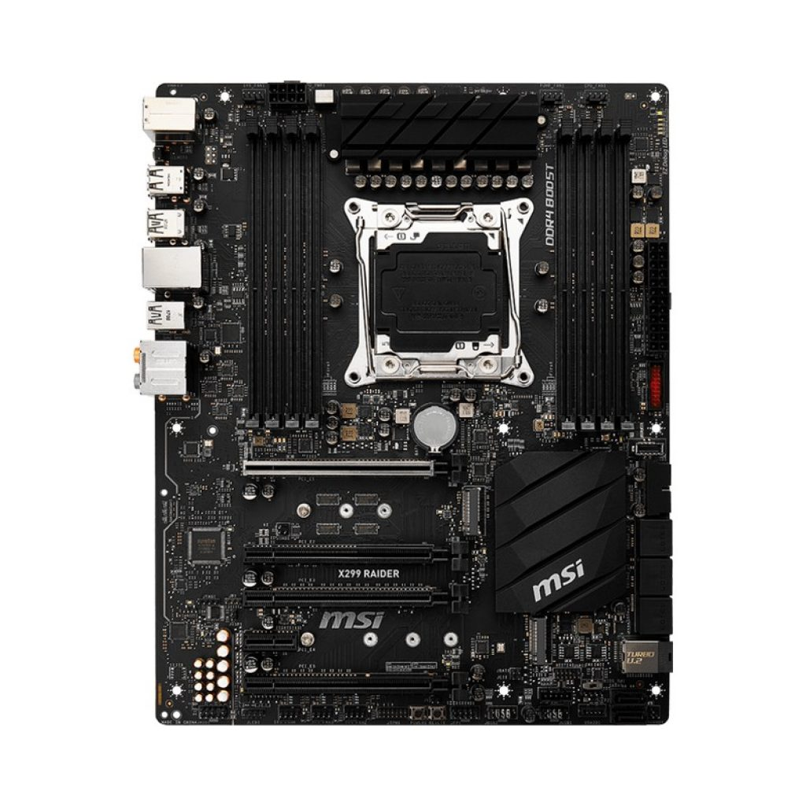
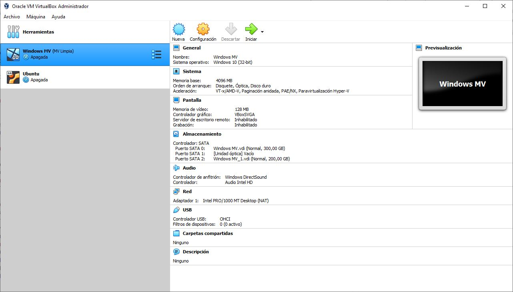
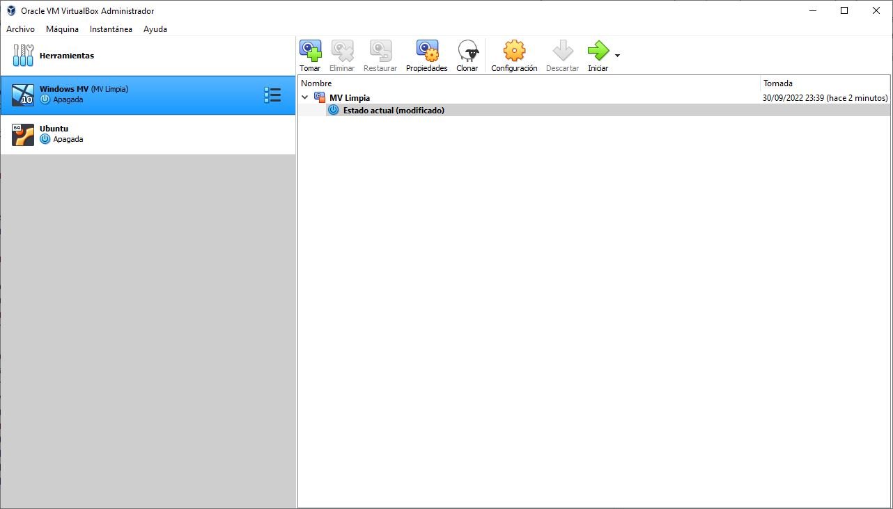
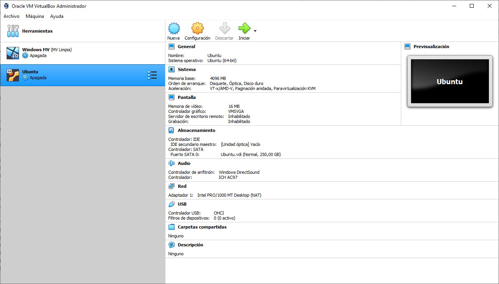
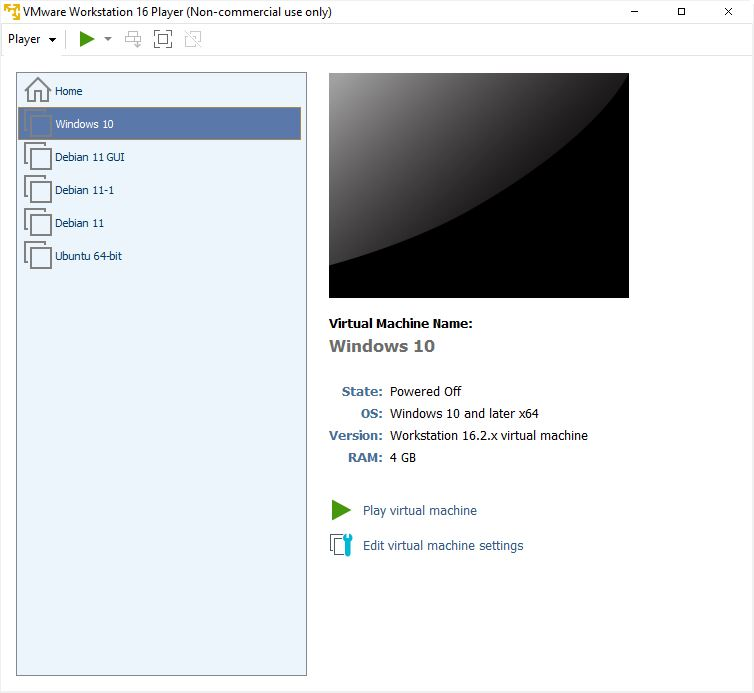

# SISTEMAS INFORMÁTICOS
## Enunciado:
Omitido para mayor brevedad.

## Ejercicio 1

### a)

### b)
Es un ATX, con unas medidas de 12 x 9.6 pulgadas (30.5 x 24.3 cm).

### c)
El socket que lleva es un LGA2066, para la familia de procesadores Intel X (conocidos también como procesadores de alto rendimiento, suelen tener una memoria caché mucho mayor que su homólogos inferiores).

Los procesadores compatibles son cualquiera que coincidan el *socket* y cumplan con las especificaciones del *chipset*. Por ejemplo:
- Familia Kabylake-X
- Familia Skylake-X

Para más información, [puedes consultar en la documentación oficial de MSI](https://es.msi.com/Motherboard/X299-RAIDER/support#cpu).

### d)
Únicamente aceptan módulos de tipo DDR4, posee 8 bancos de memoria y es *quad-channel*, aunque también puede ir en *dual-channel*, siempre cumpliendo con el orden y posicionamiento de las tarjetas de memoria RAM consultando con el manual.

### e)
Monta el *chipset* X299.

El *chipset* fue lanzado en 2017, en 22 nanómetros.

Las características más destacadas son, según las especificaciones de MSI (cosa que puede diferir desde Intel):
- Hasta 4 canales en memoria RAM
- XMP (Ideal para *overclocking*)
- SLI / CrossFire
- 8 puertos SATA
- 2 puertos M.2 PCIe

> Información: Los fabricantes normalmente ponen de nombre comercial el chipset que llevan + algún gancho.

## Ejercicio 2
Antes que nada, me gustaría matizar algunas cosas: hay una cierta mezcla con los conceptos de USB, USB-C, Thunderbolt, además de también una mezcla entre interfaz y bus.

En primer lugar, una interfaz, también conocido como conector es la forma que tiene el conector, en caso de USB, los hay de muchas formas: Type-A (común), Type-B (común en impresoras), Micro-B (antiguos de los móviles), Type-C (actuales en móviles).

Mientras que en el ejercicio hace referencia a la velocidad de transferencia del *bus*. Un *bus* es un sistema de comunicación entre componentes de un sistema, como pueden ser PCIe, FireWire, HDMI, USB, etc.

Para la tabla comparativa se han elegido el bus USB-4, eSATA 6Gbit/s y Thunderbolt 4.

| USB-4   | Thunderbolt 4 | eSATA  |
| ------- | ------------- | ------ |
| 20 Gb/s | 40 Gb/s       | 6 Gb/s |

Curiosamente, tanto USB-4 como Thunderbolt 4 tienen la misma interfaz y son totalmente compatibles entre ellas.

> Información: Hay buses diferentes con misma interfaz. Hay interfaces diferentes que utilizan el mismo bus de datos.

## Ejercicio 3
### Procesador
- Intel Core i9 9900K, 8 núcleos, 16 hilos
- 3,60GHz, 14 nanómetros, 1,2v
- MMX, SSE, SSE2, SSE3, SSSE3, SSE4, EM64T, AES, AVC, AVX2, FMA3, TSX
- L1 Data: 8 x 32Kb, L1 Inst: 8 x 32Kb, L2: 8 x 256Kb, L3: 16Mb

### Placa base
- Micro-Star International Co. Ltd. (MSI)
- MPG Z390 Gaming Pro Carbon AC
- BIOS: American Megatrends Inc

### Memorias
- 32Gb, Dual-channel
- DDR4, en 4 módulos
- CL15

### Estado componentes
- Procesador: 34°C
- Bomba agua: 2120 RPM
- HDD 1: 40°C
- HDD 2: 41°C
- SSD 1: 40°C
- SSD 2: 40°C
- GPU: 35,3°C
- Ventilador GPU: 800 RPM

## Ejercicio 4
Según el manual del fabricante los pines para reiniciar la memoria están justo encima de de la segunda línea PCIe x16. Hay que hacer puente para reinciar y el procedimiento es el siguiente:

- Apagar y desconectar de la corriente.
- Colocar un *jumper* en los dos pines entre 5 y 10 segundos.
- Retirar el *jumper*. Debería de haberse reiniciado.
- Encender el equipo

No es la primera vez que hago esta acción sobre una placa base, pero ahora no será el caso. Hay mucha configuración en la placa base detrás, ademas de tener configurado los perfiles de memoria, orden de arranque y sistemas RAID en las 4 unidades, con lo que lo último que quiero es tener que volver a configurarlo todo.

## Ejercicio 5
No se entiende lo que quiere decir. Tres ejemplos para cada tipo de *software* de qué.

## Ejercicio 6
Este documento es un poco antiguo. En estos últimos años, como mucho 4 años las placas base ya no suelen mostar la información POST por pantalla, directamente sale la imagen del fabricante. Y en los Mac tampoco sale desde que tengo uso de razón.

> POST significa Power On Self Test

Básicamente, -lo digo de memoria-, la información que mostraba por pantalla era como una especie de primera comprobación en todo el sistema antes de empezara a ejecutar el gestor de arranque del sistema operativo de turno.

Hoy en día, la comprobación inicial se sigue ejecutando, pero ya no muestra la información.

Si uno de los componentes no funciona correctamente o se detecta alguna anomaía (fecha/hora mal), se interrumpe el proceso de arranque y da una oportunidad al usuario a elegir si continuar o corregir el síntoma.

Me es imposible acceder a las utilidades de UEFI de mi placa base. Hay que presionar el boton *DEL*, pero mi teclado está desconectado mientras se enciende el sistema.

## Ejercicio 7
Te los puedo decir de memoria:

Nativos:
- XCP-ng
- Xen
- VMWare ESXi

Alojados:
- VirtualBox
- VMWare Player
- Parallels

### Ejercicio 8
- Debian
- Ubuntu
- Puppy
- Alpine
- Fedora
- CentOS
- Red Hat
- Raspberry Pi OS
- Raspbian
- Kali

### Ejercicio 9

### Ejercicio 10
Sé que no es el VMWare Pro, pero no he tenido la necesidad de hacerlo, en este caso adjunto una captura de VMWare Player, con todas las máquinas instaladas.

### Bonus track
Antes que nada, no puedo aportar capturas de mi trabajo, pero mi portafolio como administrador de sistemas es garantizar la alta disponibilidad de los contenedores Docker, vendemos *Software como servicio (SaaS)*, sector hostelería.

Hay instalado CRM, servicios de reservas y bots que gestionan reservas y notificaciones a los clientes para distintos restaurantes.

Luego, el servidor lo tenemos físicamente en Mazagón, con un Hypervisor de tipo 1, el XCP-ng, sobre él, instalados PfSense, varias copias clonadas de Debian y lo mismo para Windows Server.

### Bonus track II
Como *hobby*, también lo mismo, pero en un VPS de Heztner. Debian y sobre él, Docker con distintas bases de datos, un repositorio git autoalojado y cosas que experimento.

[Web personal](https://pedroperez.dev) | [Docker](https://docker.pedroperez.dev) | [Git](https://git.pedroperez.dev) | [GitHub](https://github.com/zepyrshut)

Todo está alojado en el VPS, gestionado por *nginx*, configurado como proxy inverso, con sus certificados correspondientes.

## Autoría
> Pedro Pérez Banda

> Jueves, 29 septiembre de 2022, Sistemas Informáticos, 1º DAW.